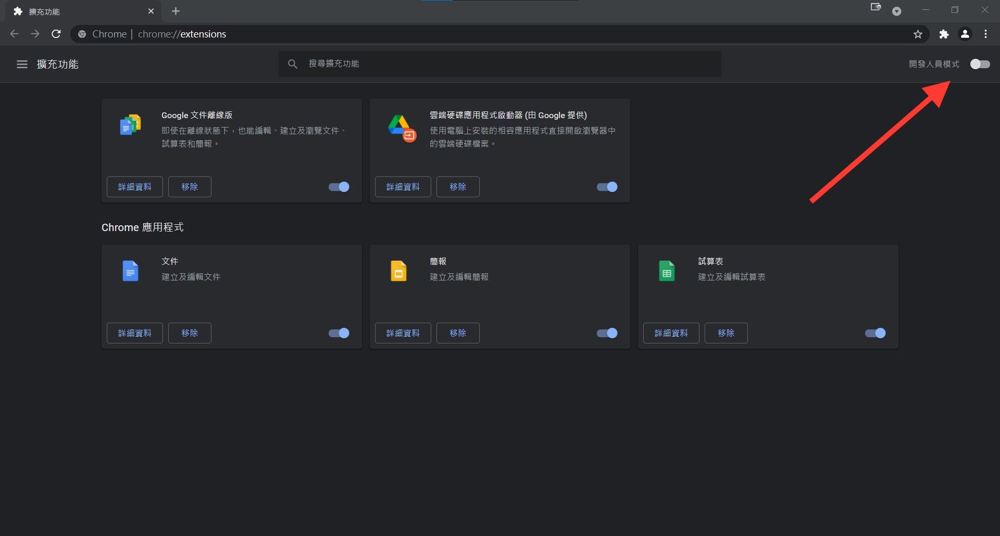
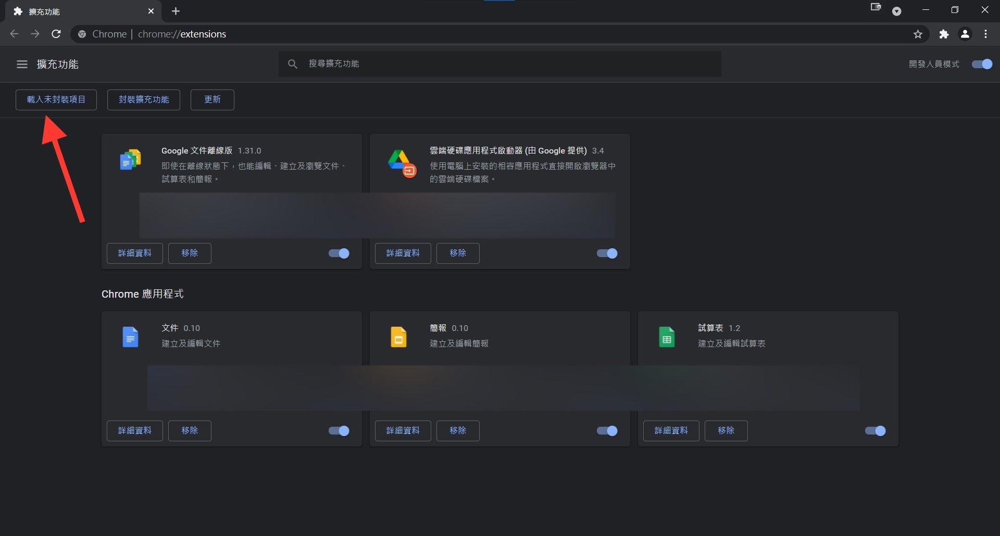
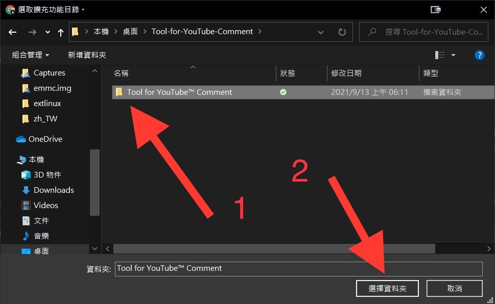
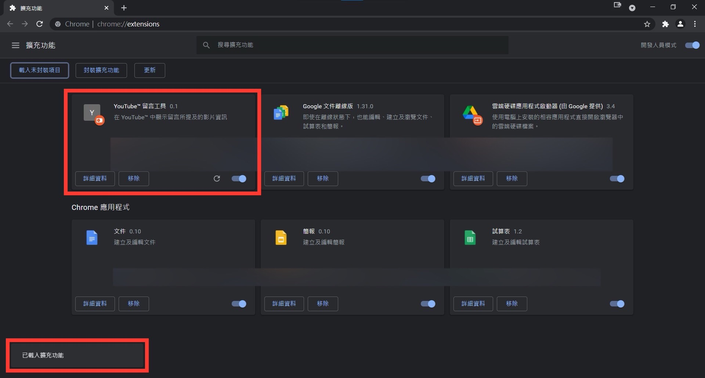

[EN](./README.md) | [正體中文](./README_TW.md) | 简体中文

# YT 视频信息工具

在 YouTube™ 中显示资讯栏及评论所提及的视频信息

## 演示

* 淺色主题

    

* 深色主题

    

## 如何使用

* 使用 Chrome Extension

    1. 下载「[yt-video-information-tool.zip](./yt-video-information-tool.zip?raw=1)」并解压缩

    1. 前往 [chrome://extensions/](chrome://extensions/)

    1. 开启开发人员模式

        

    1. 点击「载入未封装项目」

        

    1. 选择解压缩后的资料夹

        

    1. 完成

        

* 使用 UserScript（[GreasyFork 教学](https://greasyfork.org/zh-CN)）

    1. 安装使用者脚本管理器

    1. 下载或开启「[yt-video-information-tool.user.js](./yt-video-information-tool.user.js?raw=1)」

---

* Icon(svg) from [YouTube™](https://youtube.com/)
